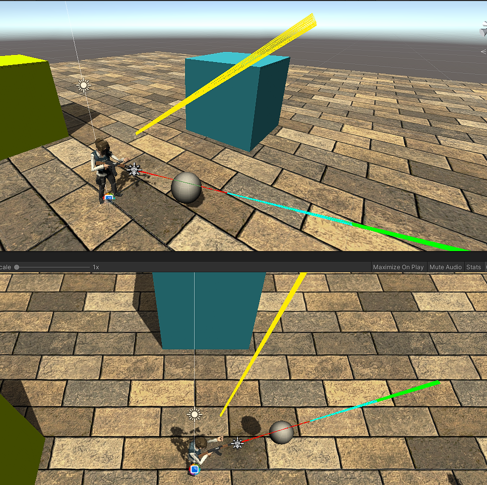
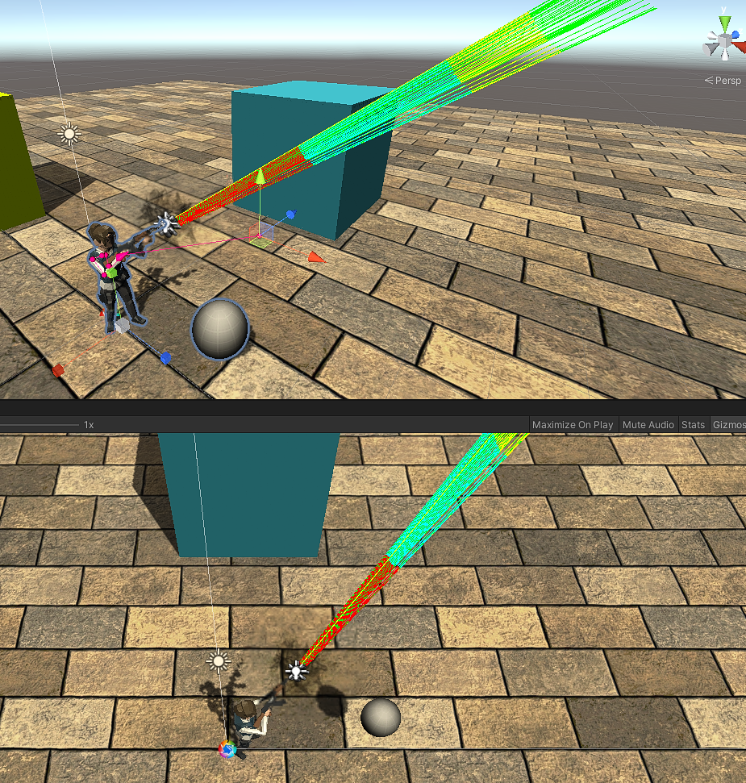
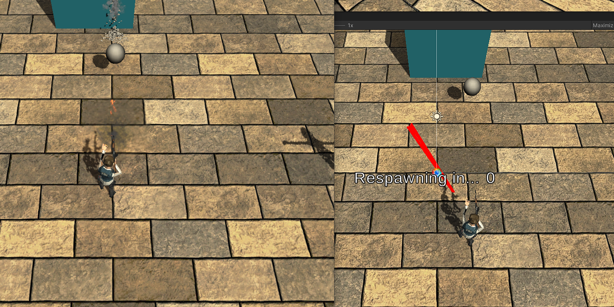
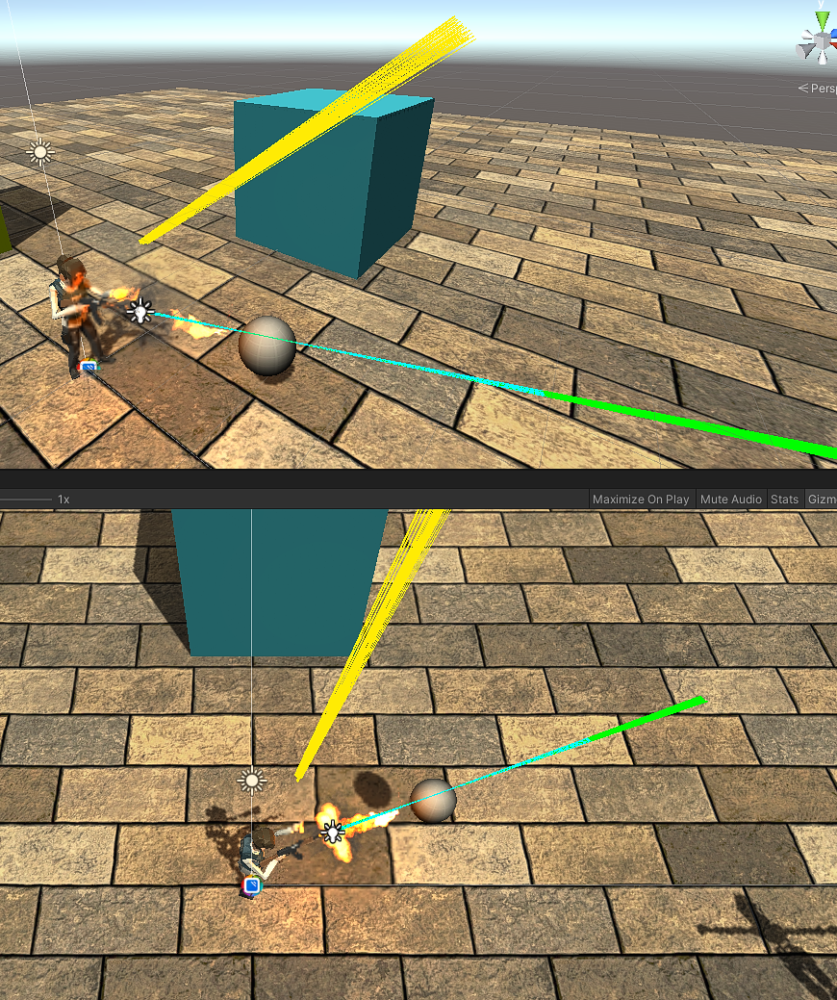

# Animation + IK + Mirror + Ragdolls = A lesson in GameDev debugging, research, and persistence

UPDATE: I found a solution to the IK timing problem, [see here](#Solution-Found)

## Ragdolls
This all started when I couldn't figure out why my character seemed to shoot in a direction that it wasn't facing visually. Imagine pointing your gun at a tree in front of you, pulling the trigger, and seeing the bullet impact the ground 10 feet to the left of the tree.... oh and the muzzle flash appears from thin air to your left instead of from your weapon.

I slowly teased out every script and component until my player character was just the absolute bare minumum. I had an Animator, Aim IK, and a FireScript.cs that shot automatically on an interval. The character STILL shot in the wrong direction.

So, I pulled in a fresh player model and slowly added scripts and components, making sure to test each time. It shot exactly where it should every time... this was maddening. The difference? All of the rigidbodies, colliders, and joints on the original character's body parts from running the Unity Ragdoll Wizard. I wrote a ragdoll controller to enable and disable these elements but I missed one critical step :)

Take a look at the diff here between the working RagdollerController and the broken one:
https://github.com/PolarKC/GameDevPublic/compare/f92010a..f7b1ddb?diff=split

You have to set all of the colliders to isTrigger -AND- set all rigidbodies to isKinematic. Forgetting one or the other could lead to a ton of headache and wasted time.

## Unity Execution Order O_o
In this screenshot there is a single player who is the Host of the game.



The raytraces seen were executed in:
- Update = Green
- FixedUpdate = Cyan
- Command = Red
- LateUpdate = Yellow

You'll notice LateUpdate is NOT in the direction that the gun is pointing visually.

---
What happens if we disable Inverse Kinematics? Below you'll see all raytraces match up with the mecanim aiming animation.




---
Okay, but we want more than one player. What if we host a server and have a separate client connect to it, what does the server view look like?



The left side of the picture is the client's view. The right side is the server in Unity where we can see the raytraces. We see only the Command ray trace, and unfortunately it is not pointing in the direction that the weapon is facing on the client OR the server.

---
Let's take a look at the client's raytraces



Similar to the original screenshot (Single player as a Host), we see that the Yellow raytrace from LateUpdate does not match the Green (Update) and Cyan (FixedUpdate) traces. The yellow trace is pointing in the direction that the gun would face if inverse kinematics was turned off.

---
So what does all of this mean? I don't know yet. But I hope this helps if you're like me and running into problems getting your animated character to shoot at a target w/ IK locally & over the network.

## Useful Links
- https://docs.unity3d.com/Manual/ExecutionOrder.html
- https://mirror-networking.com/docs/Guides/Communications/RemoteActions.html

---

## SOLUTION FOUND
If you're using Final IK Aim IK like me, you can manually call for the IK solvers to update in LateUpdate to guarantee that everything matches up:
```csharp
private void LateUpdate()
{
    aimIK.solver.Update();
}
```

This seemingly simple line of code took an incredible amount of time to find. I've watched a dozen videos and read through I'd estimate 100 articles and forum posts to find the solution.

https://forum.unity.com/threads/final-ik-full-body-ik-aim-look-at-fabrik-ccd-ik-1-0-released.222685/page-20#post-1976210