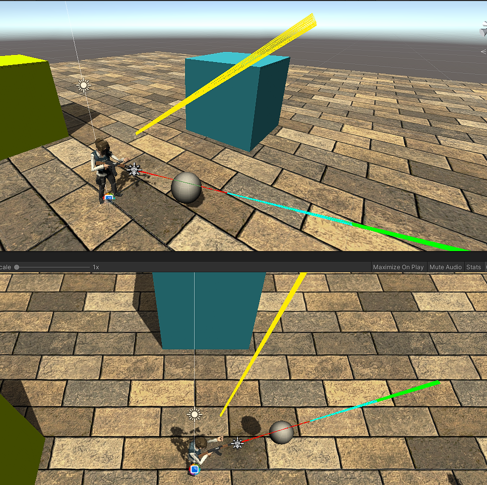
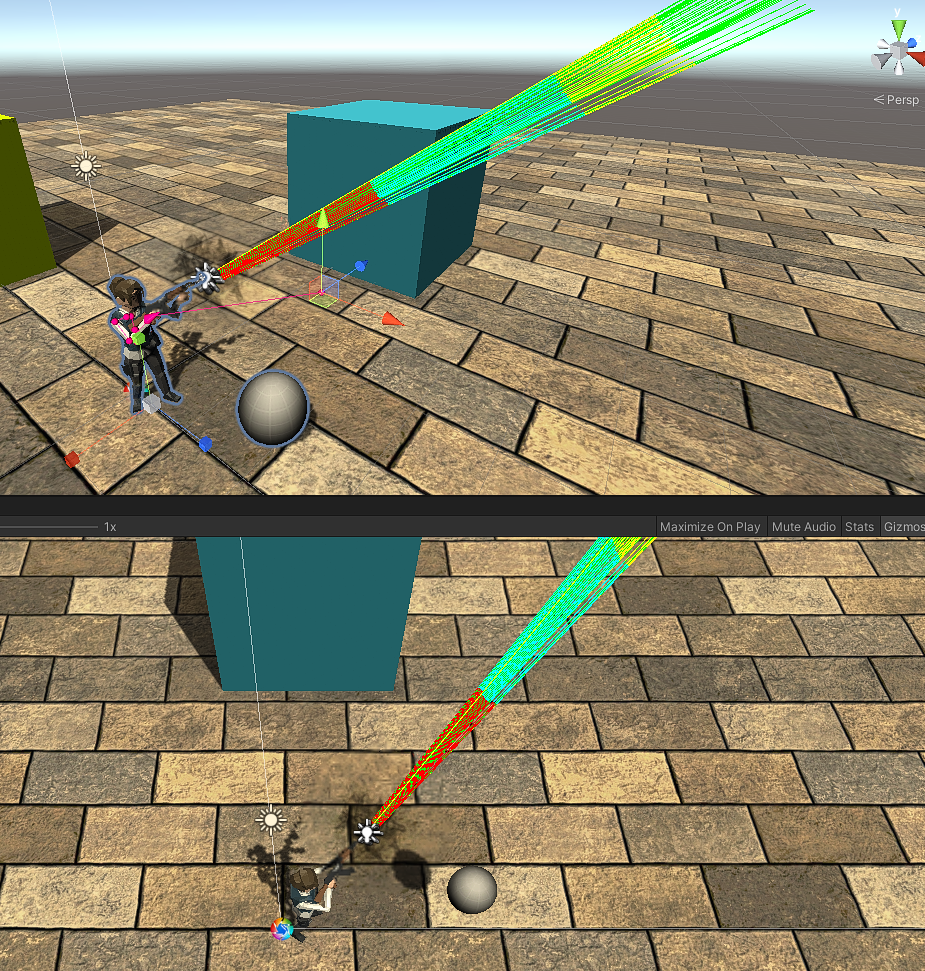
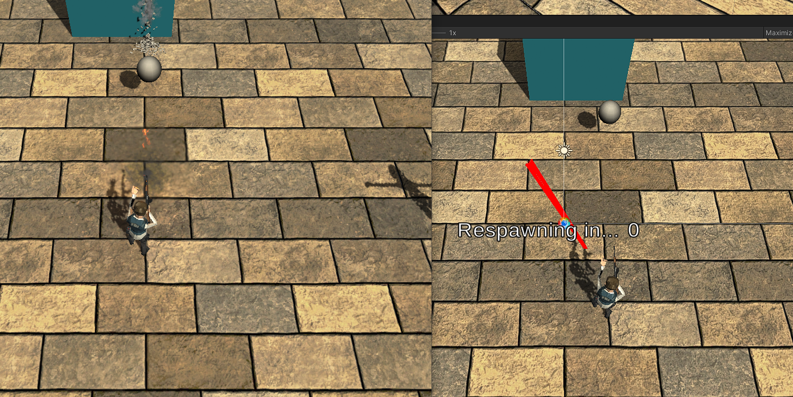
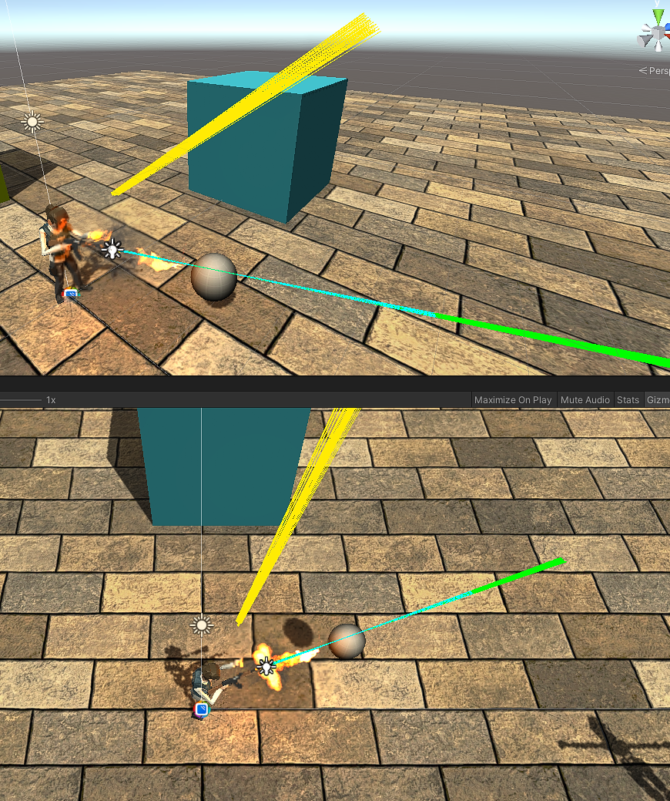

# Animation + IK + Mirror = Learning Opportunity

In this screenshot there is a single player who is the Host of the game.

The raytraces seen were executed in:
- Update = Green
- FixedUpdate = Cyan
- Command = Red
- LateUpdate = Yellow

You'll notice LateUpdate is NOT in the direction that the gun is pointing visually.

---
What happens if we disable Inverse Kinematics? Below you'll see all raytraces match up with the mecanim aiming animation.

---
Okay, but we want more than one player. What if we host a server and have a separate client connect to it, what does the server view look like?

The left side of the picture is the client's view. The right side is the server in Unity where we can see the raytraces. We see only the Command ray trace, and unfortunately it is not pointing in the direction that the weapon is facing on the client OR the server.

---
Let's take a look at the client's raytraces

Similar to the original screenshot (Single player as a Host), we see that the Yellow raytrace from LateUpdate does not match the Green (Update) and Cyan (FixedUpdate) traces. The yellow trace is pointing in the direction that the gun would face if inverse kinematics was turned off.

---
So what does all of this mean? I don't know yet. But I hope this helps if you're like me and running into problems getting your animated character to shoot at a target w/ IK locally & over the network.

## Useful Links
- https://docs.unity3d.com/Manual/ExecutionOrder.html
- https://mirror-networking.com/docs/Guides/Communications/RemoteActions.html